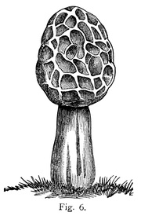

<!--

Licensed to Julian Hyde under one or more contributor license
agreements.  See the NOTICE file distributed with this work
for additional information regarding copyright ownership.
Julian Hyde licenses this file to you under the Apache
License, Version 2.0 (the "License"); you may not use this
file except in compliance with the License.  You may obtain a
copy of the License at

http://www.apache.org/licenses/LICENSE-2.0

Unless required by applicable law or agreed to in writing,
software distributed under the License is distributed on an
"AS IS" BASIS, WITHOUT WARRANTIES OR CONDITIONS OF ANY KIND,
either express or implied.  See the License for the specific
language governing permissions and limitations under the
License.

-->


# Morel
Standard ML interpreter, with relational extensions, implemented in Java

(Until version 0.1, Morel was known as smlj.)

## Requirements

Java version 8 or higher.

## Get Morel

### From Maven

Get Morel from
<a href="https://search.maven.org/#search%7Cga%7C1%7Cg%3Anet.hydromatic%20a%3Amorel">Maven Central</a>:

```xml
<dependency>
  <groupId>net.hydromatic</groupId>
  <artifactId>morel</artifactId>
  <version>0.2.0</version>
</dependency>
```

### Download and build

```bash
$ git clone git://github.com/julianhyde/morel.git
$ cd morel
$ ./mvnw install
```

On Windows, the last line is

```bash
> mvnw install
```

### Run the shell

```bash
$ ./morel
morel version 0.2.0 (java version "13", JLine terminal, xterm-256color)
= "Hello, world!";
val it = "Hello, world!" : string
= exit
$
```

## Documentation

* [Morel language reference](docs/reference.md)
* ["How to" guide](docs/howto.md)
* [Change log](HISTORY.md)
* Reading [test reference logs](src/test/resources/script)
  can be instructive; try, for example,
  [relational.sml.out](src/test/resources/script/relational.sml.out)

## Status

Implemented:
* Literals
* Variables
* Comments (`(* block *)` and `(*) line`)
* `let` (expression that lets you define local variables and functions)
* `val` (including `val rec`)
* `fun` (declare function)
* Operators: `=` `<>` `<` `>` `<=` `>=`
  `~` `abs` `+` `-` `*` `/` `div` `mod` `^` `::` `o` `@`
  `andalso` `orelse`
* Type derivation
* `fn`, function values, and function application
* `if`
* `case`
* Primitive, list, tuple and record types
* Type variables (polymorphism) (except in `let` and `datatype`)
* Algebraic types (`datatype`)
* Tuples and unit, record, list, and vector values
* Patterns (destructuring) in `val`, `case`, `fun` and `from`,
  matching constants, wildcards, tuples, records, and lists
* Basis library types and functions:
  * [Top](https://smlfamily.github.io/Basis/top-level-chapter.html):
    `eqtype int`,
    `eqtype word`,
    `type real`,
    `datatype bool = false | true`
  * [General](https://smlfamily.github.io/Basis/general.html):
    `eqtype unit`,
    `exception Size`,
    `exception Subscript`,
    `datatype order` (`LESS`, `EQUAL`, `GREATER`),
    `o`, `ignore`
  * [List](https://smlfamily.github.io/Basis/list.html):
    `exception Empty`,
    `datatype 'a list = nil | :: of ('a * 'a list)`,
    `null`, `length`, `@`, `hd`, `tl`, `last`, `getItem`, `nth`,
    `take`, `drop`, `rev`, `concat`, `revAppend`, `app`, `map`, `mapPartial`,
    `find`, `filter`, `partition`, `foldl`, `foldr`, `exists`, `all`,
    `tabulate`, `collate`
  * [Option](https://smlfamily.github.io/Basis/option.html):
    `exception Option`,
    `datatype 'a option = NONE | SOME of 'a`,
    `getOpt`, `isSome`, `valOf`, `filter`, `join`, `app`,
    `map`, `mapPartial`, `compose`, `composePartial`
  * [String](https://smlfamily.github.io/Basis/string.html):
    `eqtype char`,
    `eqtype string`,
    `maxSize`, `size`, `sub`, `extract`, `substring`, `^`,
    `concat`, `concatWith`, `str`, `implode`, `explode`,
    `map`, `translate`, `isPrefix`, `isSubstring`, `isSuffix`
  * [Vector](https://smlfamily.github.io/Basis/vector.html):
    `eqtype 'a vector`,
    `maxLen`, `fromList`, `tabulate`, `length`, `sub`, `update`, `concat`,
    `appi`, `app`, `mapi`, `map`, `foldli`, `foldri`, `foldl`, `foldr`,
    `findi`, `find`, `exists`, `all`, `collate`

Not implemented:
* `type`, `eqtype`, `exception`
* `structure`, `struct`, `signature`, `sig`, `open`
* `local`
* `raise`, `handle`
* `while`
* `use`
* References, and operators `!` and `:=`
* Operators: `before`
* User-defined operators (`infix`, `infixr`)
* Type annotations in expressions and patterns

Bugs:
* Prevent user from overriding built-in constants and functions:
  `true`, `false`, `nil`, `ref`, `it`, `::`; they should not be reserved
* Access parameters and variables by offset into a fixed-size array;
  currently we address them by name, in a map that is copied far too often
* Runtime should raise `Div` when divide by zero
* Validator should give good user error when it cannot type an expression
* See also [GitHub issues](https://github.com/julianhyde/morel/issues)

## Extensions

Morel has a few extensions to Standard ML: postfix labels,
implicit labels in record expressions, and relational extensions.
Postfix labels and implicit labels are intended to make relational
expressions more concise and more similar to SQL but they can be used
anywhere in Morel, not just in relational expressions.

### Postfix labels

Morel allows '.' for field references.
Thus `e.deptno` is equivalent to `#deptno e`.

(Postfix labels are implemented as syntactic sugar; both expressions
become an application of label `#deptno` to expression `e`.)

Because '.' is left-associative, it is a more convenient syntax for
chained references. In the standard syntax, `e.address.zipcode` would
be written `#zipcode (#address e)`.

### Implicit labels in record expressions

In standard ML, a record expression is of the form
`{label1 = exp1, label2 = exp2, ...}`; in Morel, you can omit `label =`
if the expression is an identifier, label application, or field reference.

Thus
```
{#deptno e, e.name, d}
```
is short-hand for
```
{deptno = #deptno e, name = e.name, d = d}
```

In the relational extensions, `group` and `compute` expressions also use
implicit labels. For instance,
```
from e in emps
group e.deptno compute sum of e.salary, count
```
is short-hand for
```
from e in emps
group deptno = e.deptno compute sum = sum of e.salary, count = count
```
and both expressions have type `{count:int,deptno:int,sum:int} list`.

### Relational extensions

The `from` expression (and associated `in`, `where` and `yield` keywords)
is a language extension to support relational algebra.
It iterates over a list and generates another list.

In a sense, `from` is syntactic sugar. For example, given `emps` and
`depts`, relations defined as lists of records as follows

```
val emps =
  [{id = 100, name = "Fred", deptno = 10},
   {id = 101, name = "Velma", deptno = 20},
   {id = 102, name = "Shaggy", deptno = 30};
   {id = 103, name = "Scooby", deptno = 30}];
val depts =
  [{deptno = 10, name = "Sales"},
   {deptno = 20, name = "Marketing"},
   {deptno = 30, name = "Engineering"},
   {deptno = 40, name = "Support"}];
```

the expression

```
from e in emps where e.deptno = 30 yield e.id
```

is equivalent to standard ML

```
map (fn e => (#id e)) (filter (fn e => (#deptno e) = 30) emps)
```

with the `where` and `yield` clauses emulating the `filter` and `map`
higher-order functions without the need for lambdas (`fn`).

Relational expressions are an experiment bringing the features of
query languages such as SQL into a functional language.
We believe that a little syntactic sugar, backed by a relational query
planner, makes ML into a powerful and convenient tool for querying
large data sets.
Conversely, we want to see how SQL would look if it supported lambdas,
function-values, polymorphism, pattern-matching, and removed the
syntactic distinction between tables and collection-valued columns.

You can iterate over more than one collection, and therefore generate
a join or a cartesian product:

```
from e in emps, d in depts
  where e.deptno = d.deptno
  yield {e.id, e.deptno, ename = e.name, dname = d.name};
```

As in any ML expression, you can define functions within a `from` expression,
and those functions can operate on lists. Thus we can implement equivalents of
SQL's `IN` and `EXISTS` operators:

```
let
  fun in_ e [] = false
    | in_ e (h :: t) = e = h orelse (in_ e t)
in
  from e in emps
  where in_ e.deptno (from d in depts
                where d.name = "Engineering"
                yield d.deptno)
  yield e.name
end

let
  fun exists [] = false
    | exists hd :: tl = true
in
  from e in emps
  where exists (from d in depts
                where d.deptno = e.deptno
                andalso d.name = "Engineering")
  yield e.name
end
```

In the second query, note that the sub-query inside the `exists` is
correlated (references the `e` variable from the enclosing query)
and skips the `yield` clause (because it doesn't matter which columns
the sub-query returns, just whether it returns any rows).

## More information

* License: <a href="LICENSE">Apache License, Version 2.0</a>
* Author: Julian Hyde (<a href="https://twitter.com/julianhyde">@julianhyde</a>)
* Blog: http://blog.hydromatic.net
* Project page: http://www.hydromatic.net/morel
* API: http://www.hydromatic.net/morel/apidocs
* Source code: https://github.com/julianhyde/morel
* Developers list:
  <a href="mailto:dev@calcite.apache.org">dev at calcite.apache.org</a>
  (<a href="https://mail-archives.apache.org/mod_mbox/calcite-dev/">archive</a>,
  <a href="mailto:dev-subscribe@calcite.apache.org">subscribe</a>)
* Issues: https://github.com/julianhyde/morel/issues
* <a href="HISTORY.md">Release notes and history</a>
